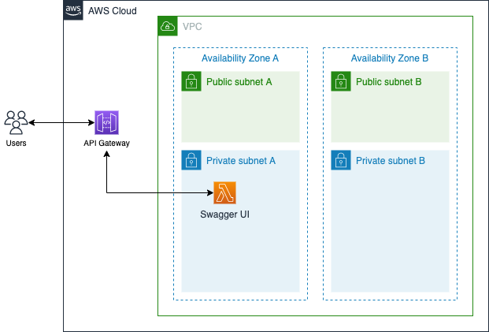

# Swagger UI served by Lambda
This example shows how to set up Swagger UI for API Gateway. It uses Lambda for serving Swagger UI.



## Prerequisites
- Make sure you have [AWS CLI](https://docs.aws.amazon.com/cli/latest/userguide/install-cliv2.html) installed and configured with an aws account you want to use.
- Ensure you have [nodejs](https://nodejs.org) installed.

### install cdk
```shell
npm install -g aws-cdk
cdk --version
```

### create virtualenv
```shell
python3 -m venv .venv
source .venv/bin/activate
```

### install requirements
```shell
pip install -r requirements.txt
```

### make Lambda Layer zip file
```shell
cd layers
./install.sh
cd ..
```
you will get swagger.zip, this file will be used to create Lambda Layer.

### setting AWS_PROFILE
```shell
export AWS_PROFILE=<the configuration profile for aws-cli>
```

# How to deploy

## First, Deploy stateful resources
```shell
cdk deploy SwaggerUI/Stateful
```
After deployment finished. Copy the S3 Bucket Name from the output.
The output looks like below.
```
Outputs:
SwaggerUIStateful3F479D90.ExportsOutputFnGetAttNetworkingSwaggerUISG96F8CF33GroupIdFEF076D7 = sg-07dcde4aa56cc65eb
SwaggerUIStateful3F479D90.ExportsOutputFnGetAttS3APIDocsCB10F954ArnA7FEBE62 = arn:aws:s3:::swaggerui-stateful-s3apidocscb10f954-1q9j1u6i6ctu
SwaggerUIStateful3F479D90.ExportsOutputRefNetworkingVPCPrivateSubnet1SubnetA4560E1F1EC76AC4 = subnet-0958de613203332ff
SwaggerUIStateful3F479D90.ExportsOutputRefNetworkingVPCPrivateSubnet2Subnet388EEB72AB01EAC9 = subnet-07606fe133947524e
SwaggerUIStateful3F479D90.S3BucketName099EDA80 = swaggerui-stateful-s3apidocscb10f954-1q9j1u6i6ctu
Stack ARN:
arn:aws:cloudformation:ap-northeast-2:927208760804:stack/SwaggerUI-Stateful/bb01f180-f105-11ec-ad94-0a9de810c42a
```


## Second, Deploy stateless resources 
```shell
cdk deploy SwaggerUI/Stateless
```
After deployment finished. Copy the API Gateway Endpoint from the output.
The output looks like below.
```
Outputs:
SwaggerUIStatelessAD411EB5.APIGwEndpoint2CC41FEF = https://fyp0p7n8q8.execute-api.ap-northeast-2.amazonaws.com/prod/
Stack ARN:
arn:aws:cloudformation:ap-northeast-2:927208760804:stack/SwaggerUI-Stateless/13efd670-f1c1-11ec-9bb7-0a2886132568
```

Then go to AWS Console.
1) In the console, go to API Gateway and select SwaggerUI. 
2) In SwaggerUI, select Stages -> prod.
3) Click Export tab and download json file from Export as Swagger.

## Upload json file to S3
Upload json file to S3 bucket, the bucket name is the one you copied from the deployment output.

## Update environment variables of lambda function.
Execute command like below. you need to change BUCKET_NAME and KEY_NAME (json file name).
```shell
aws lambda update-function-configuration --function-name APIDocsFunc \
    --environment "Variables={BUCKET_NAME=swaggerui-stateful-s3apidocscb10f954-1q9j1u6i6ctu,KEY_NAME=SwaggerUI-prod-swagger.json}"
```

## Load Swagger UI
Using copied API Gateway Endpoint, open Swagger UI in browser. the URL will be, 

API Gateway Endpoint + /api-docs/

you can see POST and GET api description for sample API.

### POST


### GET
